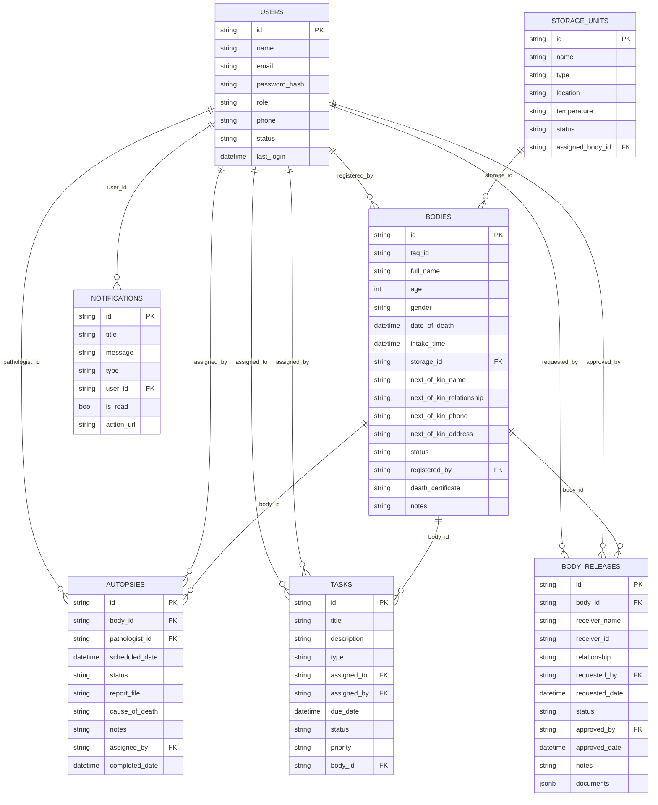
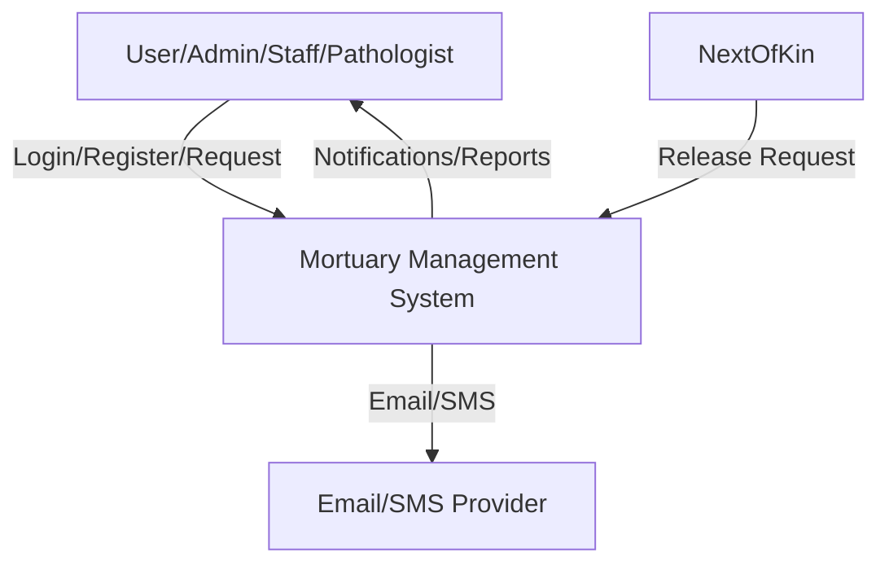
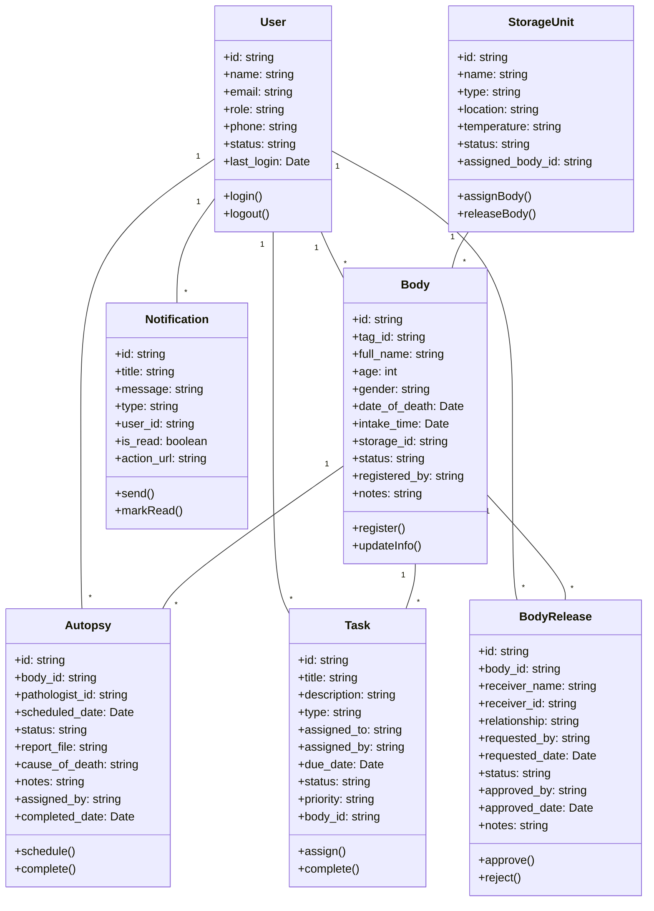
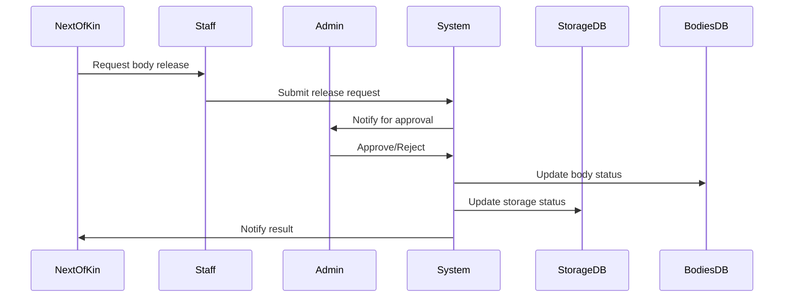
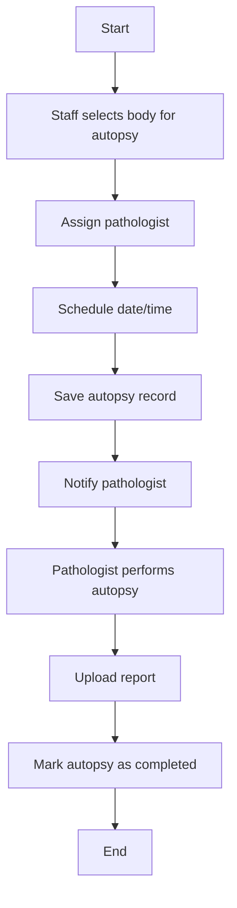

# Mortuary Management System - System Models

This document provides a comprehensive set of system models for the Mortuary Management System, using [Mermaid](https://mermaid-js.github.io/) diagrams. Each section includes a brief explanation and the Mermaid code for the diagram.

---

## 1. Use Case Diagram

Shows the main actors and their interactions with the system.

```mermaid
usecaseDiagram
  actor Admin
  actor Staff
  actor Pathologist
  actor NextOfKin
  actor System

  Admin -- (Manage Users)
  Admin -- (View Reports)
  Admin -- (Configure System)
  Admin -- (Approve Releases)
  Admin -- (Assign Tasks)
  Admin -- (Assign Autopsies)

  Staff -- (Register Body)
  Staff -- (Update Body Info)
  Staff -- (Request Body Release)
  Staff -- (Perform Tasks)
  Staff -- (View Notifications)

  Pathologist -- (Perform Autopsy)
  Pathologist -- (Upload Autopsy Report)
  Pathologist -- (View Assigned Tasks)
  Pathologist -- (View Notifications)

  NextOfKin -- (Request Body Release)

  System -- (Send Notifications)
  System -- (Auto-logout)
  System -- (Enforce Security)
```

---

## 2. Entity-Relationship Diagram (ERD)

Shows the main entities and their relationships.



---

## 3. Data Flow Diagram (DFD)

### Level 0 (Context Diagram)



### Level 2 (Body Release Process)

```mermaid
graph TD
  NOK[Next of Kin] -->|Request Release| Staff
  Staff -->|Submit Release Request| System
  System->>Admin: Notify for approval
  Admin->>System: Approve/Reject
  System->>BodiesDB: Update body status
  System->>StorageDB: Update storage status
  System->>NOK: Notify result
```

---

## 4. Class Diagram



---

## 5. Component Diagram

```mermaid
componentDiagram
  component WebApp {
    UI
    Auth
    Notification
    Reports
    Settings
  }
  component Backend {
    API
    AuthService
    TaskService
    BodyService
    AutopsyService
    ReleaseService
    NotificationService
    ReportService
    StorageService
    UserService
  }
  component Database
  component Supabase
  component EmailSMSProvider

  WebApp --> Backend
  Backend --> Database
  Backend --> Supabase
  Backend --> EmailSMSProvider
```

---

## 6. Sequence Diagram (Body Release)



---

## 7. Activity Diagram (Autopsy Scheduling)



---

**All diagrams above are in valid Mermaid format and can be rendered in any Mermaid-compatible viewer.** 